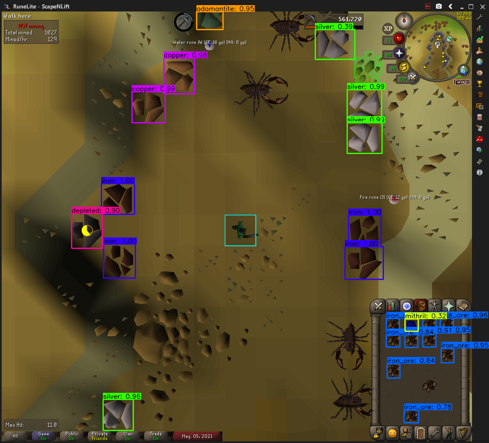
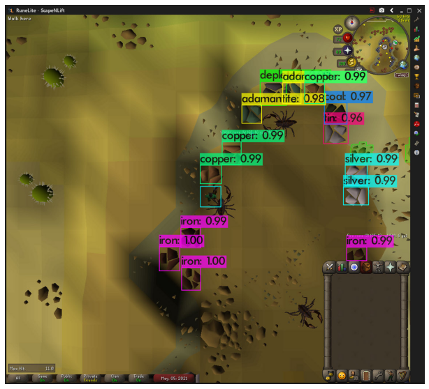
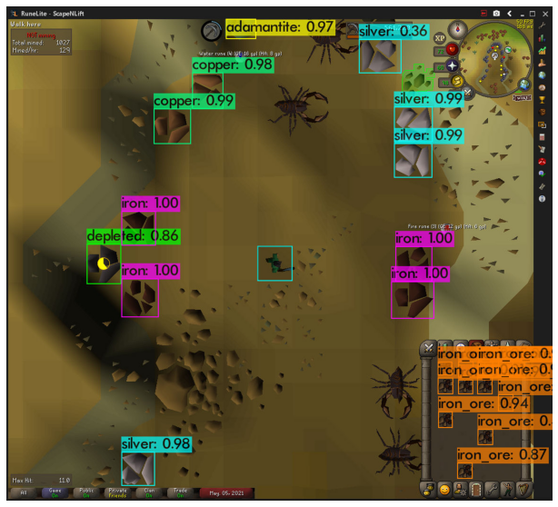

# OSRS-MINING-AI
NOTE: Most of the files in here are originally from https://github.com/theAIGuysCode/tensorflow-yolov4-tflite so all credit to the original creator. I modified the files and code to be specific to my trained model. If you wish to learn how to convert yolov4 models to tensorflow and much more follow the link above.

Here I trained a neural network using yolov4. The trained weights file was then used to create a tensorflow model. I then used the tensorflow model alongside openCV and some I/O python libraries such as pyautogui to automate the mining skill in the game Old School Runescape. This was a quick project and I learned a lot and also made many mistakes, however I am pleased with how the bot turned out. All of the files I have here are configured specifically for my trained neural network, the screen_capture script can definitely be modified and used for other models as well.

The darknet files contain the weights I've trained at 1400 iterations and 3000 iterations respectively, along with the custom dataset that I trained the model on as well, and various other files such as .names and .data files.

The checkpoint folder contains the tensorflow model that is based off of the yolov4 weights I trained.

The screen_capture.py script has a while loop constantly capturing the screen and utilises the tensorflow model to identify objects. The position of the relevant rock is recorded (in our case iron rocks) and an additional thread is spawned to handle mining the rock. The thread then waits for an event trigger to exit, this event is the addition of an iron ore into our inventory. The process then repeats, once we have five or more iron ores in our inventory the script will identify and drop all of them so we never run out of inventory space.

Below are some examples of the neural network:  

  

Early tests of the network (1400 iterations), notice some iron ores are not being identified in the inventory

  

Another early test, the network identifies every ore rock correctly

  

Here is an example of the early model's detection on a pre-recorded video  

  

After much more training (3000 iterations) it correctly identifies every iron ore in the inventory and every ore rock

  

An example of the final fully automated script working via screen capture (apologies for the bad quality and stutter, the fps was really bad)
